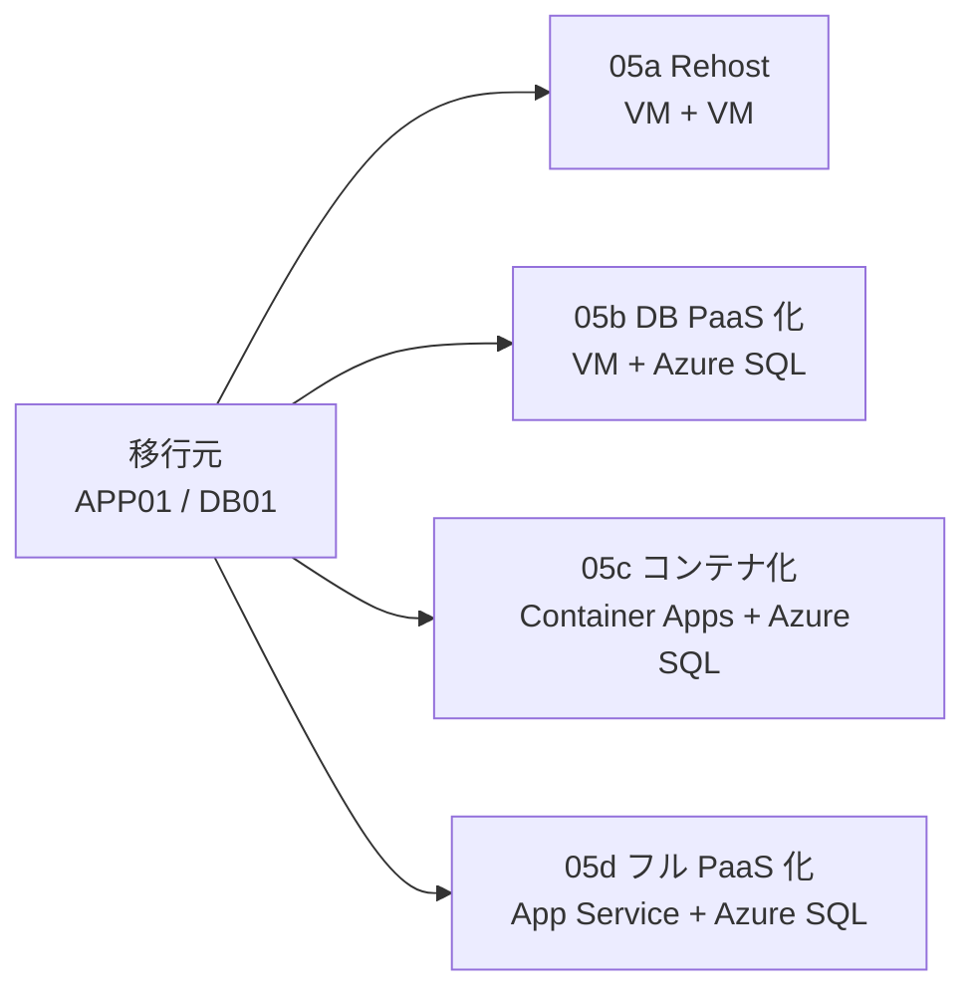
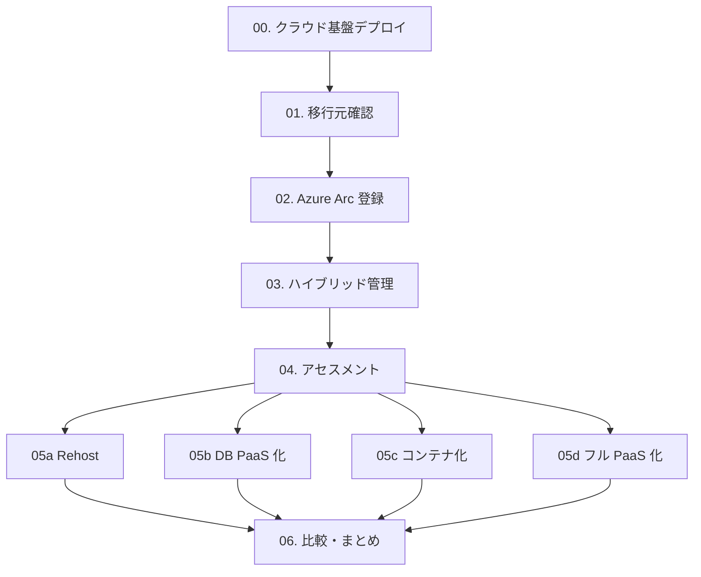

# クラウド移行 HOL - アーキテクチャ図

## 1. 全体ネットワーク構成

```mermaid
architecture-beta
    group onprem(cloud)[OnPrem VNet 10.0.0.0/16]
    group hub(cloud)[Hub VNet 10.10.0.0/16]
    group s1(cloud)[Spoke1 10.20.0.0/16]
    group s2(cloud)[Spoke2 10.21.0.0/16]
    group s3(cloud)[Spoke3 10.22.0.0/16]
    group s4(cloud)[Spoke4 10.23.0.0/16]

    service dc(server)[DC01] in onprem
    service dbsrc(database)[DB01] in onprem
    service appsrc(server)[APP01] in onprem

    service fw(internet)[Azure Firewall] in hub
    service vpngw(internet)[VPN Gateway] in hub
    service bastion(server)[Azure Bastion] in hub
    service law(database)[Log Analytics] in hub
    service migrate(server)[Azure Migrate] in hub

    service s1web(server)[Web VM] in s1
    service s1db(database)[DB VM] in s1

    service s2web(server)[Web VM] in s2
    service s2db(database)[Azure SQL] in s2

    service s3app(server)[Container Apps] in s3
    service s3db(database)[Azure SQL] in s3

    service s4app(server)[App Service] in s4
    service s4db(database)[Azure SQL] in s4

    dc:R -- L:dbsrc
    dbsrc:R -- L:appsrc
    appsrc:R --> L:vpngw
    bastion:B --> T:s1web
    bastion:B --> T:s2web
    fw:R -- L:s1web
    fw:R -- L:s2web
    fw:R -- L:s3app
    fw:R -- L:s4app
    migrate:L --> R:appsrc
```

## 2. 移行パターン比較フロー

```mermaid
flowchart LR
    SRC[移行元\nAPP01 / DB01] --> A[05a Rehost\nVM + VM]
    SRC --> B[05b DB PaaS 化\nVM + Azure SQL]
    SRC --> C[05c コンテナ化\nContainer Apps + Azure SQL]
    SRC --> D[05d フル PaaS 化\nApp Service + Azure SQL]
```

## 3. ハンズオンの流れ

```mermaid
flowchart TD
    P0[00. クラウド基盤デプロイ] --> P1[01. 移行元確認]
    P1 --> P2[02. Azure Arc 登録]
    P2 --> P3[03. ハイブリッド管理]
    P3 --> P4[04. アセスメント]
    P4 --> P5A[05a Rehost]
    P4 --> P5B[05b DB PaaS 化]
    P4 --> P5C[05c コンテナ化]
    P4 --> P5D[05d フル PaaS 化]
    P5A --> P6[06. 比較・まとめ]
    P5B --> P6
    P5C --> P6
    P5D --> P6
```
