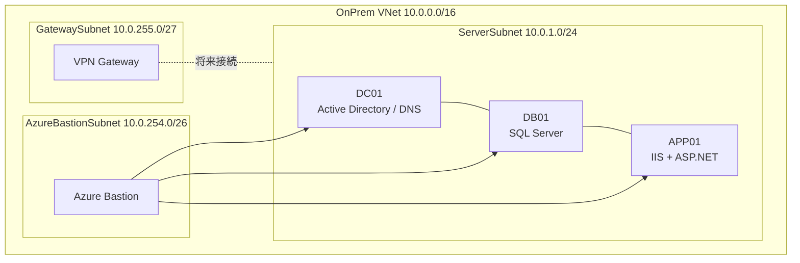
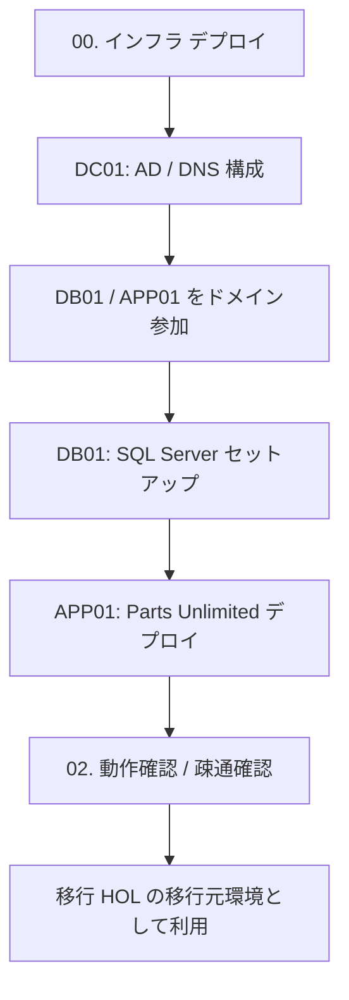
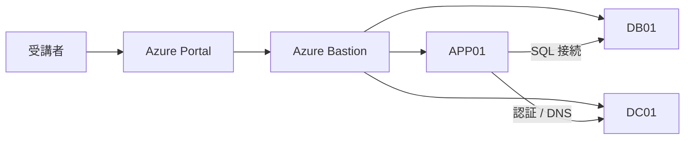

# 疑似オンプレ環境アーキテクチャ図

## 1. 全体構成図

## 2. デプロイ & セットアップ フロー

## 3. 接続イメージ

## 4. 補足

- **インバウンドの管理アクセスは Bastion 経由に集約**します
- **APP01 → DB01 / DC01** の内部通信で 3 層構成を成立させます
- 将来的には **VPN Gateway** を介して Hub VNet や移行先環境と接続する前提です
